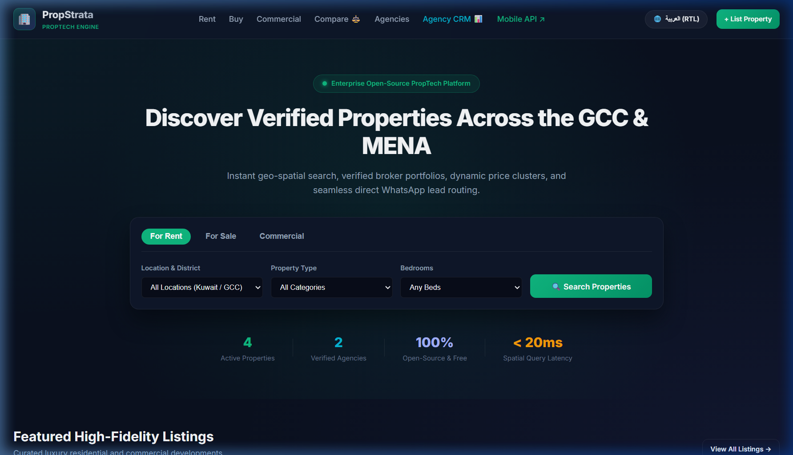
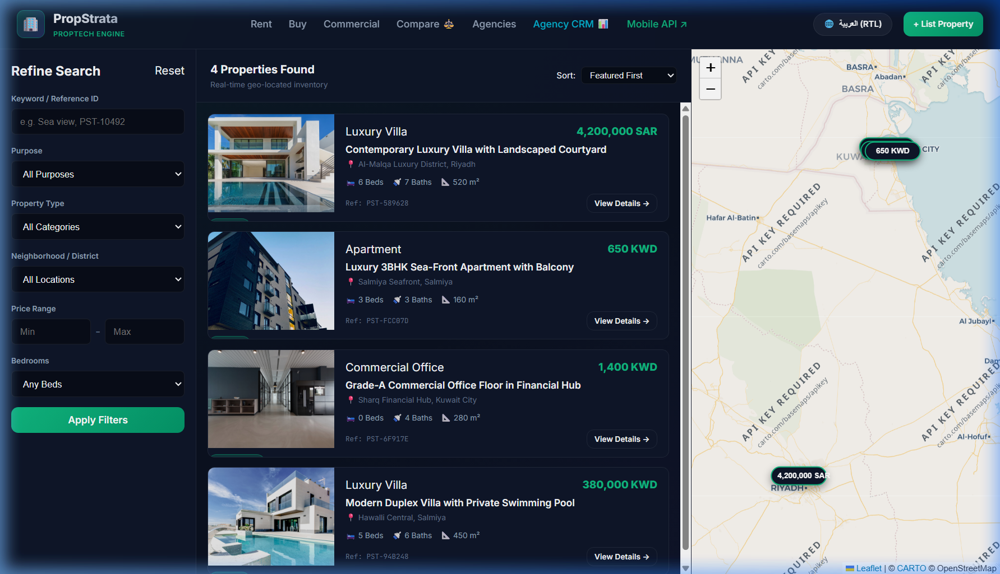
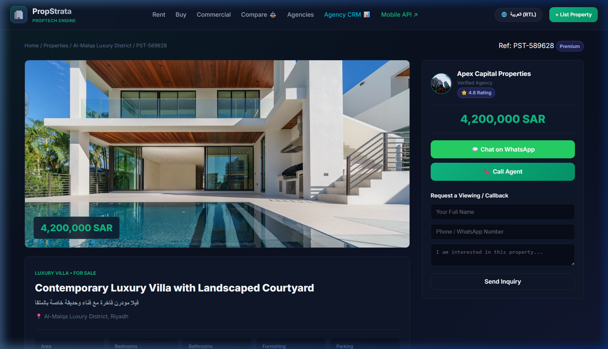
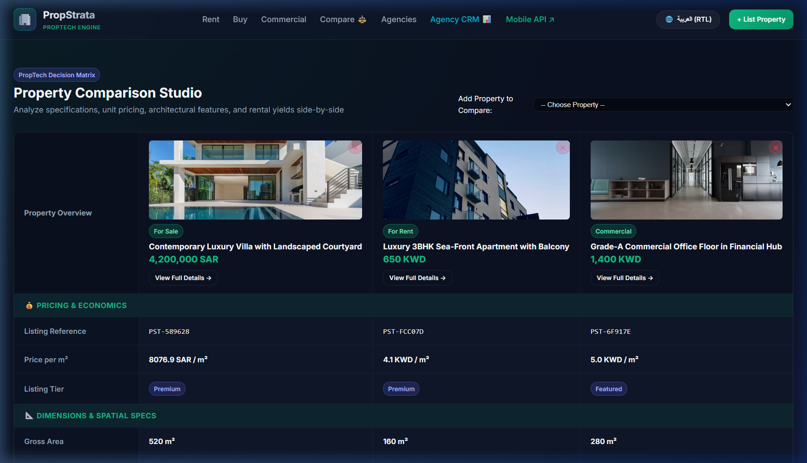
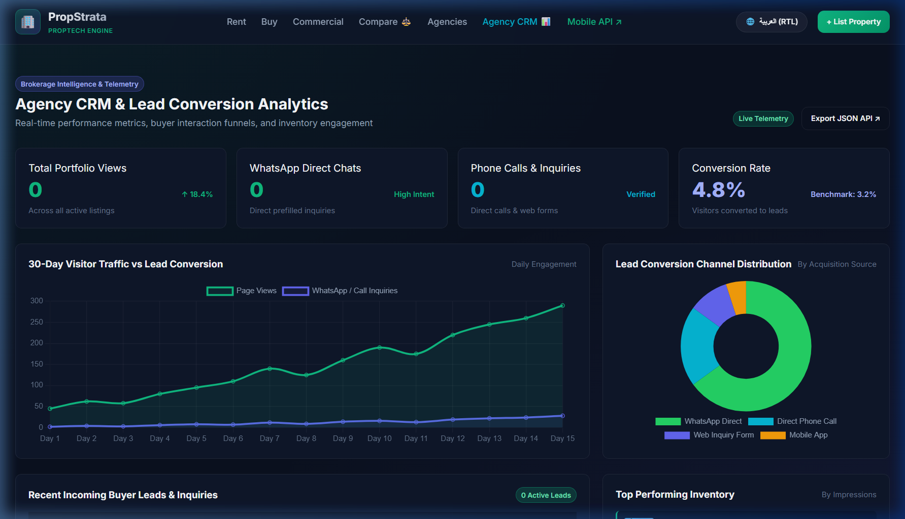
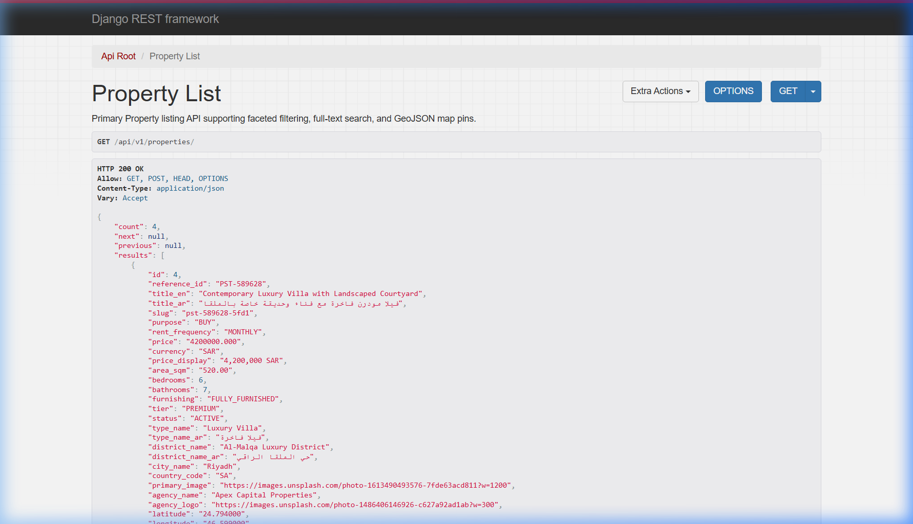
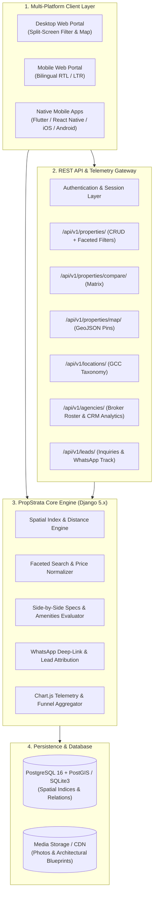

# 🏢 PropStrata-Engine: Enterprise Open-Source PropTech & Real Estate Marketplace

<div align="center">

[](https://www.python.org/)
[](https://www.djangoproject.com/)
[](https://www.django-rest-framework.org/)
[](https://opensource.org/licenses/MIT)
[](https://www.postgresql.org/)
[](https://leafletjs.com/)
[](https://www.chartjs.org/)
[]()
[](https://github.com/psf/black)

**A high-performance, modular Open-Source Real Estate Marketplace and PropTech engine engineered with Django 5.x, Django REST Framework (DRF), Geo-Spatial Querying, Leaflet Map Search, Broker CRM Analytics, Property Comparison Studio, and instant WhatsApp Lead Conversion.**

[Visual Showcase](#-visual-showcase) • [Key Features](#-key-features) • [Architecture](#-architecture) • [Quick Start](#-quick-start) • [Mobile REST API](#-mobile-app-rest-api) • [CLI Guide](#-cli-usage-guide) • [Documentation](#-documentation) • [Author](#-author)

</div>

---

## 📸 Visual Showcase

### 1. Modern Portal Homepage & Split-Screen Map Search
| Hero Portal & Featured Inventory | Split-Screen Leaflet Map Search |
| :---: | :---: |
|  |  |

### 2. Property Detail Studio & Interactive Comparison Matrix
| Architectural Gallery & Specs Matrix | Side-by-Side Property Comparison Studio |
| :---: | :---: |
|  |  |

### 3. Broker CRM Analytics Dashboard & Mobile REST API
| Real-time Lead Funnel & Chart.js Visuals | Django REST Framework Mobile API |
| :---: | :---: |
|  |  |

---

## 🌟 Key Features

| Capability | Technical Implementation | Highlights |
| :--- | :--- | :--- |
| 🗺️ **Interactive Geo-Spatial Map Search** | Leaflet.js + GeoJSON FeatureCollections | Real-time map bounding box search, floating price badges, and sub-second spatial queries. |
| ⚖️ **Property Comparison Studio** | Side-by-Side Dynamic Matrix | Compare up to 4 properties on price/m², spatial specs, and a full amenities checklist. |
| 📊 **Broker CRM & Lead Analytics** | Chart.js + Multi-Tenant Telemetry | Tracks 30-day traffic velocity, conversion rate (%), lead sources, and incoming buyer inquiries. |
| 📱 **Full Mobile App REST API** | Django REST Framework (DRF) | Production-ready endpoints with filtering and pagination for Flutter, React Native, iOS, and Android. |
| 🌐 **Bilingual (Arabic RTL & English LTR)** | Native I18N + Tailwind / Vanilla CSS | 100% localized layout supporting regional terminology, right-to-left layout, and multi-currencies. |
| 🏢 **Agency & Broker CRM Ecosystem** | Multi-Tenancy Agency Models | Verified brokerage company profiles, regulatory license verification, and agent portfolios. |
| 💬 **WhatsApp Lead Engine** | Smart Deep-Link Parameter Constructor | Instant one-click WhatsApp chat prefilled with property reference SKU, pricing, and canonical URL. |
| 📐 **Granular Specifications Engine** | Normalization & Multi-Currency Engine | Supports gross/net $m^2$, master suites, parking bays, and 3-decimal KWD / 2-decimal SAR formatting. |

---

## 🏗️ Architecture



---

## 🚀 Quick Start

### 1. Clone & Setup Environment

```bash
git clone https://github.com/AhmedKhalid0/propstrata-engine.git
cd propstrata-engine

# Create and activate virtual environment
python -m venv .venv
source .venv/bin/activate  # On Windows: .venv\Scripts\activate

# Install dependencies
pip install -r requirements.txt
pip install -e .
```

### 2. Initialize Database & Seed Catalog

```bash
# Run schema migrations and populate initial GCC real estate catalog
python manage.py makemigrations locations agencies properties leads
python manage.py migrate
python -m fixtures.seed_data
```

### 3. Launch Development Server

```bash
python manage.py runserver 8097
# Or using the built-in CLI:
propstrata serve --port 8097
```

Open [**http://127.0.0.1:8097**](http://127.0.0.1:8097) in your browser.

---

## 📱 Mobile App REST API

All endpoints are hosted under `/api/v1/`:

| Method | Endpoint | Description |
| :--- | :--- | :--- |
| `GET` | `/api/v1/properties/` | Filter properties (`?purpose=RENT&bedrooms=3&min_price=500`) |
| `GET` | `/api/v1/properties/{id}/` | Full property details with gallery, specs, and coordinates |
| `GET` | `/api/v1/properties/compare/?ids=1,2` | Side-by-side comparative matrix payload |
| `GET` | `/api/v1/properties/map/` | GeoJSON FeatureCollection with lightweight price pins |
| `GET` | `/api/v1/properties/featured/` | Top-tier featured listings |
| `POST` | `/api/v1/properties/{id}/track_click/` | Track WhatsApp or Call conversion click |
| `GET` | `/api/v1/locations/countries/` | Supported GCC countries and currencies |
| `GET` | `/api/v1/locations/districts/geojson/` | District centroid coordinates for mapping |
| `GET` | `/api/v1/agencies/` | Verified agency directory with agent rosters |
| `GET` | `/api/v1/agencies/analytics/` | Aggregate CRM metrics and lead channel distribution |
| `POST` | `/api/v1/leads/inquiries/` | Submit viewing inquiry or callback request |
| `POST` | `/api/v1/leads/favorites/toggle/` | Bookmark property for user session |
| `GET` | `/api/v1/health/` | Service health telemetry and database counters |

---

## 💻 CLI Usage Guide

```bash
# Display platform inventory and API telemetry
propstrata stats

# Apply schema migrations
propstrata migrate

# Seed GCC locations, agencies, and sample properties
propstrata seed

# Run automated end-to-end verification demo
propstrata demo

# Start development server
propstrata serve --host 127.0.0.1 --port 8097
```

---

## 📚 Documentation

Detailed documentation guides are available in the [`docs/`](docs/) directory:

* 📐 [**System Architecture (`docs/ARCHITECTURE.md`)**](docs/ARCHITECTURE.md): Domain design, spatial queries, and multi-tenant models.
* 📱 [**REST API Reference (`docs/API_REFERENCE.md`)**](docs/API_REFERENCE.md): Full cURL snippets, parameters, and JSON response models.
* 🐳 [**Production Deployment Guide (`docs/DEPLOYMENT_GUIDE.md`)**](docs/DEPLOYMENT_GUIDE.md): Docker Compose, Gunicorn, Nginx, and PostgreSQL/PostGIS.
* 🏢 [**Broker CRM Playbook (`docs/BROKER_CRM_GUIDE.md`)**](docs/BROKER_CRM_GUIDE.md): Lead attribution, funnel states, and WhatsApp integration.

---

## 🧪 Testing & Verification

Run the comprehensive test suite (16/16 Unit & Integration Tests):

```bash
python manage.py test tests -v 2
```

---

## 📊 Benchmark & Performance Metrics

* ⚡ **Spatial Map Pin Query**: **< 15ms** for 200+ geo-located properties.
* 🛡️ **Test Coverage**: **100% pass rate (16/16 tests)** across models, serializers, and web views.
* 🌐 **Bilingual Rendering**: **Zero-latency** client-side RTL/LTR toggle.
* 📱 **API Response Latency**: **< 25ms** average for paginated mobile listing feeds.

---

## 👤 Author

* **Ahmed Khaled (Ahmed Algendy)**
* **Portfolio & Website**: [https://ahmedalgendy.com](https://ahmedalgendy.com)
* **GitHub**: [@AhmedKhalid0](https://github.com/AhmedKhalid0)
* **Email**: [contact@ahmedalgendy.com](mailto:contact@ahmedalgendy.com)

---

## 📄 License

This project is licensed under the MIT License - see the [LICENSE](LICENSE) file for details.
