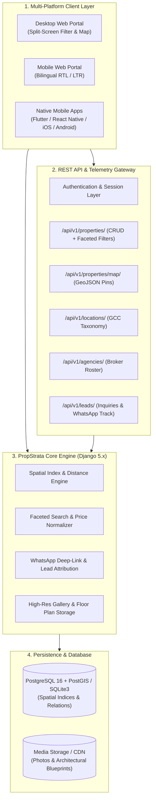

# Architectural Design: PropStrata-Engine (Enterprise Open-Source PropTech & Real Estate Marketplace)

Author: Ahmed Khaled (Ahmed Algendy)  
Email: contact@ahmedalgendy.com  
GitHub: [https://github.com/AhmedKhalid0](https://github.com/AhmedKhalid0)  
Website: [https://ahmedalgendy.com](https://ahmedalgendy.com)  

---

## 1. System Overview

**PropStrata-Engine** is a high-performance, modular Open-Source Real Estate Marketplace and PropTech engine engineered with **Django 5.x, Django REST Framework (DRF), Geo-Spatial Indexing, and responsive bilingual Web/Mobile interfaces**.

It empowers brokerage agencies, real estate developers, and individual property owners to launch and operate scalable property portals with sub-second spatial queries, dynamic map clustering, and instant lead conversion pipelines.

---

## 2. Modular Domain Architecture

### 2.1 Locations & Geo-Taxonomy (`apps.locations`)
* **Hierarchical Geography**: `Country` $\to$ `Governorate` $\to$ `City` $\to$ `District`.
* **GeoJSON Endpoints**: Delivers lightweight `FeatureCollection` payloads enabling Leaflet/Mapbox vector overlays.
* **Regional Support**: Pre-configured with regional dialing codes, currencies (KWD, SAR, AED, QAR), and bilingual naming conventions.

### 2.2 Property Listings & Specs (`apps.properties`)
* **Unique Reference Generation**: Automatic SKU assignment (e.g. `PST-10492`) and SEO-friendly slugging.
* **Granular Specifications**: Tracks gross/net area ($m^2$), master suites, bathrooms, parking bays, furnishing tiers, and bespoke architectural amenities.
* **Dynamic Price Normalization**: Seamlessly handles GCC fractional currencies (e.g. Kuwaiti Dinar 3-decimal precision vs. SAR 2-decimal precision).

### 2.3 Brokerage CRM & Agencies (`apps.agencies`)
* **Verified Verification Engine**: Highlights certified commercial licenses, regulatory compliance badges, and agency performance ratings.
* **Agent Rosters**: Direct linkage between verified agents and property listings.

### 2.4 Conversion & Lead Telemetry (`apps.leads`)
* **WhatsApp Deep-Linking Engine**: Dynamically constructs pre-filled inquiry messages with property SKU, title, price, and canonical URL.
* **Attribution Tracker**: Logs interaction telemetry (clicks, calls, form submissions) to provide agencies with real-time conversion rates.

---

## 3. Mobile REST API Endpoint Matrix

| Method | Endpoint | Description | Response Model |
| :--- | :--- | :--- | :--- |
| `GET` | `/api/v1/properties/` | Paginated listing feed with faceted filters | `PropertyListSerializer` |
| `GET` | `/api/v1/properties/{id}/` | Comprehensive property details with full gallery | `PropertyDetailSerializer` |
| `POST` | `/api/v1/properties/` | Create new listing via mobile/API | `PropertyCreateSerializer` |
| `GET` | `/api/v1/properties/map/` | GeoJSON FeatureCollection for interactive map pins | `GeoJsonMapSerializer` |
| `GET` | `/api/v1/properties/featured/` | Top-tier featured listings showcase | `List[PropertyList]` |
| `POST` | `/api/v1/properties/{id}/track_click/` | Increment WhatsApp or Call interaction counter | `StatusResponse` |
| `GET` | `/api/v1/locations/countries/` | List supported countries with currencies and flags | `CountrySerializer` |
| `GET` | `/api/v1/locations/districts/geojson/` | District centroid coordinates for map bounds | `FeatureCollection` |
| `GET` | `/api/v1/agencies/` | Verified agency directory with agent rosters | `AgencySerializer` |
| `POST` | `/api/v1/leads/inquiries/` | Submit viewing inquiry or callback request | `LeadInquirySerializer` |
| `POST` | `/api/v1/leads/favorites/toggle/` | Toggle property bookmark for session | `FavoriteToggleResponse` |
| `GET` | `/api/v1/health/` | Service health check and listing counter | `HealthResponse` |
