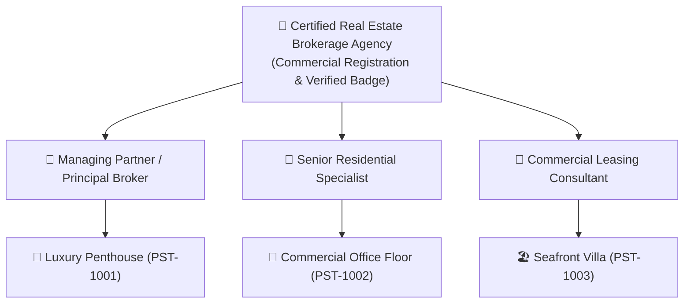
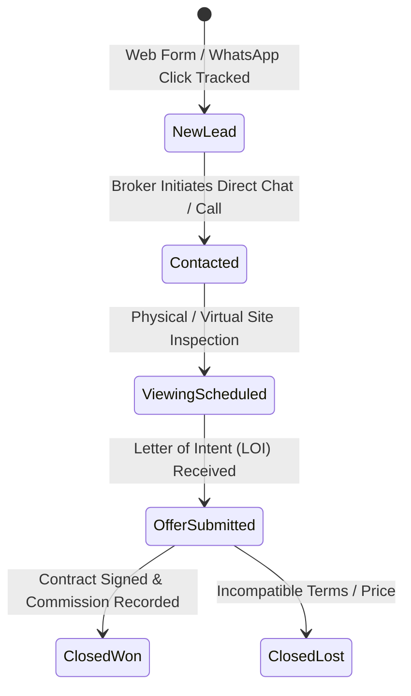

# Broker CRM & WhatsApp Lead Conversion Playbook

This document details the multi-tenancy agency architecture and automated WhatsApp conversion attribution engine within **PropStrata-Engine**.

---

## 1. Multi-Tenancy Agency Hierarchy



---

## 2. Dynamic WhatsApp Deep-Link Constructor

PropStrata eliminates friction for property buyers by constructing intelligent prefilled WhatsApp URLs that preserve listing context across platforms:

```text
https://wa.me/{agent_whatsapp}?text={encoded_message}
```

### Prefilled Parameter Structure:
* **Property Reference**: `[PST-589628]`
* **Property Title**: `Contemporary Luxury Villa with Landscaped Courtyard`
* **Asking Price**: `4,200,000 SAR`
* **Canonical URL**: `https://propstrata.com/properties/pst-589628-5fd1/`

---

## 3. Lead Conversion Pipeline Stages



---

## 4. CRM Telemetry & Conversion Rate Formula

Agencies access real-time analytics in the dashboard (`/agencies/analytics/`):

$$\text{Conversion Rate} = \left( \frac{\text{WhatsApp Clicks} + \text{Phone Calls} + \text{Web Form Leads}}{\text{Total Unique Listing Views}} \right) \times 100$$
