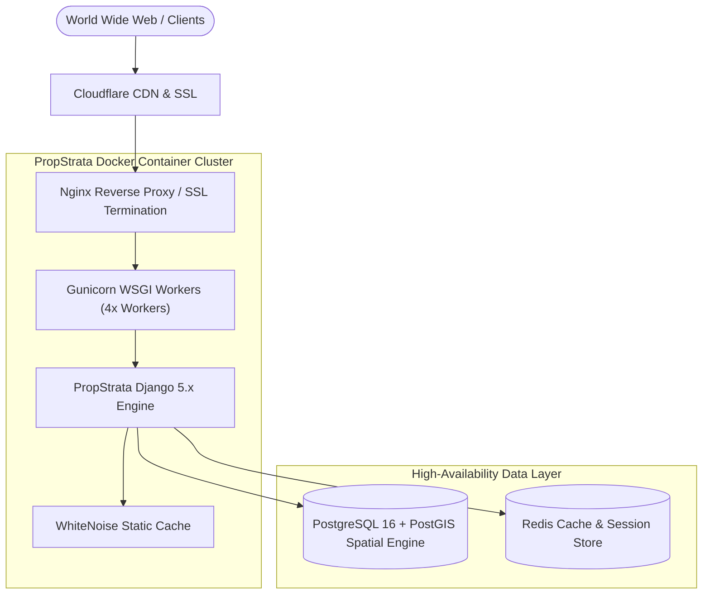

# PropStrata-Engine Production Deployment & Infrastructure Guide

This guide details running **PropStrata-Engine** in enterprise production environments using **Docker, Docker Compose, PostgreSQL 16 + PostGIS, Nginx, Gunicorn, and Redis**.

---

## 1. Architecture Overview



---

## 2. Environment Configuration (`.env`)

Create `.env` in the root project directory:

```ini
DEBUG=False
SECRET_KEY=your-ultra-secure-production-django-key-32-chars-min
ALLOWED_HOSTS=yourdomain.com,api.yourdomain.com,127.0.0.1

# Database Configuration (PostgreSQL)
DB_ENGINE=django.db.backends.postgresql
DB_NAME=propstrata_prod
DB_USER=propstrata_admin
DB_PASSWORD=your_strong_db_password
DB_HOST=postgres
DB_PORT=5432

# Redis Cache
REDIS_URL=redis://redis:6379/1

# Security Settings
SECURE_SSL_REDIRECT=True
SESSION_COOKIE_SECURE=True
CSRF_COOKIE_SECURE=True
```

---

## 3. Docker Compose Orchestration

### `Dockerfile`
```dockerfile
FROM python:3.12-slim

ENV PYTHONDONTWRITEBYTECODE=1 \
    PYTHONUNBUFFERED=1

WORKDIR /app

RUN apt-get update && apt-get install -y --no-install-recommends \
    gcc libpq-dev gdal-bin libgdal-dev && \
    rm -rf /var/lib/apt/lists/*

COPY requirements.txt .
RUN pip install --no-cache-dir -r requirements.txt

COPY . .

RUN python manage.py collectstatic --noinput

EXPOSE 8000
CMD ["gunicorn", "propstrata_core.wsgi:application", "--bind", "0.0.0.0:8000", "--workers", "4"]
```

### `docker-compose.yml`
```yaml
version: '3.8'

services:
  web:
    build: .
    restart: always
    env_file: .env
    ports:
      - "8000:8000"
    depends_on:
      - postgres
      - redis

  postgres:
    image: postgis/postgis:16-3.4
    restart: always
    environment:
      POSTGRES_DB: propstrata_prod
      POSTGRES_USER: propstrata_admin
      POSTGRES_PASSWORD: your_strong_db_password
    volumes:
      - postgres_data:/var/lib/postgresql/data

  redis:
    image: redis:7-alpine
    restart: always

volumes:
  postgres_data:
```

---

## 4. Production Deployment Checklist

1. **Apply Migrations & Create Superuser**:
   ```bash
   docker-compose run web python manage.py migrate
   docker-compose run web python manage.py createsuperuser
   ```
2. **Seed Regional Catalog**:
   ```bash
   docker-compose run web python -m fixtures.seed_data
   ```
3. **Verify Health Telemetry**:
   ```bash
   curl -I https://yourdomain.com/api/v1/health/
   ```
